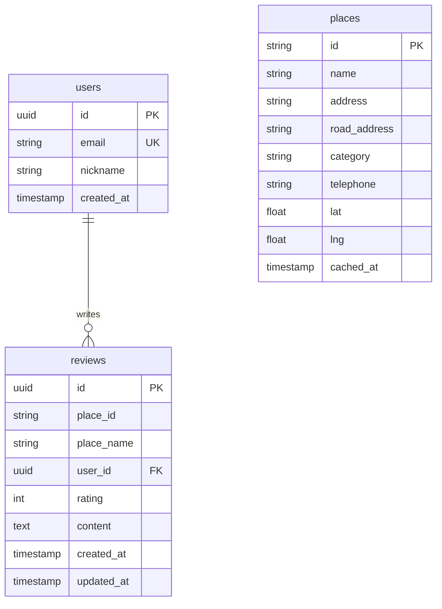

# NaviSpot - Database Schema

## 데이터베이스 개요

NaviSpot은 Supabase (PostgreSQL)를 사용하며, 다음 3개의 테이블로 구성됩니다:
- `users`: 사용자 정보
- `reviews`: 장소별 리뷰
- `places` (선택): 검색 결과 캐싱 (성능 최적화용)

---

## ERD (Entity Relationship Diagram)



---

## 테이블 정의

### 1. users 테이블

**목적**: 사용자 정보 저장

| 컬럼명 | 타입 | 제약 조건 | 설명 |
|--------|------|----------|------|
| `id` | UUID | PRIMARY KEY, DEFAULT gen_random_uuid() | 사용자 고유 ID (Supabase Auth UID 사용) |
| `email` | VARCHAR(255) | UNIQUE, NOT NULL | 이메일 주소 |
| `nickname` | VARCHAR(50) | NOT NULL | 닉네임 (리뷰 작성자 표시용) |
| `created_at` | TIMESTAMPTZ | DEFAULT NOW() | 계정 생성 일시 |

**인덱스**:
- `PRIMARY KEY (id)`
- `UNIQUE INDEX idx_users_email ON users(email)`

**RLS (Row Level Security)**:
```sql
-- 모든 사용자는 자신의 정보만 조회 가능
CREATE POLICY select_own_user ON users
FOR SELECT USING (auth.uid() = id);

-- 모든 사용자는 자신의 정보만 수정 가능
CREATE POLICY update_own_user ON users
FOR UPDATE USING (auth.uid() = id);
```

---

### 2. reviews 테이블

**목적**: 장소별 리뷰 저장

| 컬럼명 | 타입 | 제약 조건 | 설명 |
|--------|------|----------|------|
| `id` | UUID | PRIMARY KEY, DEFAULT gen_random_uuid() | 리뷰 고유 ID |
| `place_id` | VARCHAR(100) | NOT NULL | 네이버 장소 ID (mapx-mapy 형식) |
| `place_name` | VARCHAR(200) | NOT NULL | 장소명 (검색 결과에서 가져옴) |
| `user_id` | UUID | FOREIGN KEY REFERENCES users(id) ON DELETE CASCADE | 작성자 ID |
| `rating` | SMALLINT | NOT NULL, CHECK (rating >= 1 AND rating <= 5) | 별점 (1-5) |
| `content` | TEXT | NOT NULL, CHECK (LENGTH(content) <= 500) | 리뷰 내용 (최대 500자) |
| `created_at` | TIMESTAMPTZ | DEFAULT NOW() | 작성 일시 |
| `updated_at` | TIMESTAMPTZ | DEFAULT NOW() | 수정 일시 |

**인덱스**:
- `PRIMARY KEY (id)`
- `INDEX idx_reviews_place_id ON reviews(place_id)` (장소별 리뷰 조회 최적화)
- `INDEX idx_reviews_user_id ON reviews(user_id)` (사용자별 리뷰 조회 최적화)

**RLS (Row Level Security)**:
```sql
-- 모든 인증된 사용자는 모든 리뷰 조회 가능
CREATE POLICY select_reviews ON reviews
FOR SELECT TO authenticated
USING (true);

-- 인증된 사용자는 리뷰 작성 가능
CREATE POLICY insert_reviews ON reviews
FOR INSERT TO authenticated
WITH CHECK (auth.uid() = user_id);

-- 본인 리뷰만 수정 가능
CREATE POLICY update_own_review ON reviews
FOR UPDATE TO authenticated
USING (auth.uid() = user_id);

-- 본인 리뷰만 삭제 가능
CREATE POLICY delete_own_review ON reviews
FOR DELETE TO authenticated
USING (auth.uid() = user_id);
```

---

### 3. places 테이블 (선택사항)

**목적**: 네이버 검색 결과 캐싱 (API 호출 줄이기)

| 컬럼명 | 타입 | 제약 조건 | 설명 |
|--------|------|----------|------|
| `id` | VARCHAR(100) | PRIMARY KEY | 네이버 장소 ID (mapx-mapy 형식) |
| `name` | VARCHAR(200) | NOT NULL | 장소명 |
| `address` | VARCHAR(300) | | 지번 주소 |
| `road_address` | VARCHAR(300) | | 도로명 주소 |
| `category` | VARCHAR(100) | | 카테고리 (예: "음식점>카페,디저트") |
| `telephone` | VARCHAR(20) | | 전화번호 |
| `lat` | DOUBLE PRECISION | NOT NULL | 위도 |
| `lng` | DOUBLE PRECISION | NOT NULL | 경도 |
| `cached_at` | TIMESTAMPTZ | DEFAULT NOW() | 캐시 저장 일시 |

**인덱스**:
- `PRIMARY KEY (id)`
- `INDEX idx_places_location ON places USING GIST (ll_to_earth(lat, lng))` (지리 기반 검색)

**RLS**:
```sql
-- 모든 사용자는 장소 정보 조회 가능
CREATE POLICY select_places ON places
FOR SELECT TO authenticated
USING (true);
```

---

## SQL 마이그레이션 파일

**파일**: `supabase/migrations/20251023_initial.sql`

```sql
-- ================================================
-- NaviSpot Initial Schema
-- ================================================

-- 1. users 테이블 생성
CREATE TABLE IF NOT EXISTS users (
  id UUID PRIMARY KEY DEFAULT gen_random_uuid(),
  email VARCHAR(255) UNIQUE NOT NULL,
  nickname VARCHAR(50) NOT NULL,
  created_at TIMESTAMPTZ NOT NULL DEFAULT NOW()
);

-- users 인덱스
CREATE UNIQUE INDEX IF NOT EXISTS idx_users_email ON users(email);

-- users RLS 활성화
ALTER TABLE users ENABLE ROW LEVEL SECURITY;

-- users RLS 정책
CREATE POLICY select_own_user ON users
FOR SELECT USING (auth.uid() = id);

CREATE POLICY update_own_user ON users
FOR UPDATE USING (auth.uid() = id);

-- ================================================

-- 2. reviews 테이블 생성
CREATE TABLE IF NOT EXISTS reviews (
  id UUID PRIMARY KEY DEFAULT gen_random_uuid(),
  place_id VARCHAR(100) NOT NULL,
  place_name VARCHAR(200) NOT NULL,
  user_id UUID NOT NULL REFERENCES users(id) ON DELETE CASCADE,
  rating SMALLINT NOT NULL CHECK (rating >= 1 AND rating <= 5),
  content TEXT NOT NULL CHECK (LENGTH(content) <= 500),
  created_at TIMESTAMPTZ NOT NULL DEFAULT NOW(),
  updated_at TIMESTAMPTZ NOT NULL DEFAULT NOW()
);

-- reviews 인덱스
CREATE INDEX IF NOT EXISTS idx_reviews_place_id ON reviews(place_id);
CREATE INDEX IF NOT EXISTS idx_reviews_user_id ON reviews(user_id);

-- reviews RLS 활성화
ALTER TABLE reviews ENABLE ROW LEVEL SECURITY;

-- reviews RLS 정책
CREATE POLICY select_reviews ON reviews
FOR SELECT TO authenticated
USING (true);

CREATE POLICY insert_reviews ON reviews
FOR INSERT TO authenticated
WITH CHECK (auth.uid() = user_id);

CREATE POLICY update_own_review ON reviews
FOR UPDATE TO authenticated
USING (auth.uid() = user_id);

CREATE POLICY delete_own_review ON reviews
FOR DELETE TO authenticated
USING (auth.uid() = user_id);

-- ================================================

-- 3. reviews updated_at 자동 갱신 트리거
CREATE OR REPLACE FUNCTION update_updated_at_column()
RETURNS TRIGGER AS $$
BEGIN
  NEW.updated_at = NOW();
  RETURN NEW;
END;
$$ language 'plpgsql';

CREATE TRIGGER update_reviews_updated_at
BEFORE UPDATE ON reviews
FOR EACH ROW
EXECUTE FUNCTION update_updated_at_column();

-- ================================================

-- 4. places 테이블 (선택사항 - 캐싱용)
CREATE TABLE IF NOT EXISTS places (
  id VARCHAR(100) PRIMARY KEY,
  name VARCHAR(200) NOT NULL,
  address VARCHAR(300),
  road_address VARCHAR(300),
  category VARCHAR(100),
  telephone VARCHAR(20),
  lat DOUBLE PRECISION NOT NULL,
  lng DOUBLE PRECISION NOT NULL,
  cached_at TIMESTAMPTZ NOT NULL DEFAULT NOW()
);

-- places 인덱스 (지리 기반 검색용)
CREATE EXTENSION IF NOT EXISTS earthdistance CASCADE;
CREATE INDEX IF NOT EXISTS idx_places_location ON places USING GIST (ll_to_earth(lat, lng));

-- places RLS
ALTER TABLE places ENABLE ROW LEVEL SECURITY;

CREATE POLICY select_places ON places
FOR SELECT TO authenticated
USING (true);

-- ================================================

-- 5. 샘플 데이터 (개발/테스트용)
-- INSERT INTO users (id, email, nickname) VALUES
--   ('00000000-0000-0000-0000-000000000001', 'test@example.com', '테스트유저');

-- INSERT INTO reviews (place_id, place_name, user_id, rating, content) VALUES
--   ('1270000-375000', '스타벅스 강남역점', '00000000-0000-0000-0000-000000000001', 5, '커피가 맛있어요!');
```

---

## TypeScript 타입 정의

**파일**: `types/database.ts`

```typescript
// Supabase Database 타입
export interface Database {
  public: {
    Tables: {
      users: {
        Row: User
        Insert: Omit<User, 'id' | 'created_at'>
        Update: Partial<Omit<User, 'id' | 'created_at'>>
      }
      reviews: {
        Row: Review
        Insert: Omit<Review, 'id' | 'created_at' | 'updated_at'>
        Update: Partial<Omit<Review, 'id' | 'created_at' | 'user_id'>>
      }
      places: {
        Row: Place
        Insert: Omit<Place, 'cached_at'>
        Update: Partial<Omit<Place, 'id' | 'cached_at'>>
      }
    }
  }
}

export interface User {
  id: string
  email: string
  nickname: string
  created_at: string
}

export interface Review {
  id: string
  place_id: string
  place_name: string
  user_id: string
  rating: number
  content: string
  created_at: string
  updated_at: string
}

export interface Place {
  id: string
  name: string
  address: string | null
  road_address: string | null
  category: string | null
  telephone: string | null
  lat: number
  lng: number
  cached_at: string
}

// 리뷰 + 사용자 정보 조인 결과
export interface ReviewWithUser extends Review {
  user: Pick<User, 'nickname'>
}
```

---

## 데이터 접근 패턴

### 1. 리뷰 작성
```typescript
import { supabase } from '@/lib/supabase'
import type { Database } from '@/types/database'

type ReviewInsert = Database['public']['Tables']['reviews']['Insert']

async function createReview(review: ReviewInsert) {
  const { data, error } = await supabase
    .from('reviews')
    .insert(review)
    .select()
    .single()

  if (error) throw error
  return data
}
```

### 2. 장소별 리뷰 조회 (사용자 정보 포함)
```typescript
async function getReviewsByPlace(placeId: string) {
  const { data, error } = await supabase
    .from('reviews')
    .select(`
      *,
      user:users(nickname)
    `)
    .eq('place_id', placeId)
    .order('created_at', { ascending: false })

  if (error) throw error
  return data as ReviewWithUser[]
}
```

### 3. 평균 평점 계산
```typescript
async function getAverageRating(placeId: string) {
  const { data, error } = await supabase
    .from('reviews')
    .select('rating')
    .eq('place_id', placeId)

  if (error) throw error

  if (!data || data.length === 0) {
    return { average: 0, count: 0 }
  }

  const sum = data.reduce((acc, review) => acc + review.rating, 0)
  const average = sum / data.length

  return {
    average: Math.round(average * 10) / 10, // 소수점 1자리
    count: data.length,
  }
}
```

### 4. 리뷰 수정
```typescript
async function updateReview(id: string, content: string, rating: number) {
  const { data, error } = await supabase
    .from('reviews')
    .update({ content, rating })
    .eq('id', id)
    .select()
    .single()

  if (error) throw error
  return data
}
```

### 5. 리뷰 삭제
```typescript
async function deleteReview(id: string) {
  const { error } = await supabase
    .from('reviews')
    .delete()
    .eq('id', id)

  if (error) throw error
}
```

---

## RLS (Row Level Security) 정책 설명

### 왜 RLS를 사용하는가?
- **보안 강화**: 서버 사이드 로직 없이도 데이터 접근 제어
- **자동 필터링**: 쿼리 시 자동으로 권한 체크
- **SQL 인젝션 방지**: Supabase 클라이언트가 안전하게 처리

### RLS 동작 방식
```typescript
// 클라이언트 코드
await supabase
  .from('reviews')
  .delete()
  .eq('id', 'some-review-id')

// Supabase가 자동으로 추가하는 WHERE 조건:
// WHERE id = 'some-review-id' AND user_id = auth.uid()
```

**효과**:
- 본인 리뷰만 삭제 가능
- 다른 사용자 리뷰는 자동으로 필터링됨
- 서버 로직 불필요

---

## 인덱스 전략

### 1. 장소별 리뷰 조회 최적화
```sql
-- 자주 실행되는 쿼리:
SELECT * FROM reviews WHERE place_id = 'xxx' ORDER BY created_at DESC;

-- 인덱스:
CREATE INDEX idx_reviews_place_id ON reviews(place_id);
```

### 2. 사용자별 리뷰 조회 최적화
```sql
-- 자주 실행되는 쿼리:
SELECT * FROM reviews WHERE user_id = 'yyy';

-- 인덱스:
CREATE INDEX idx_reviews_user_id ON reviews(user_id);
```

### 3. 지리 기반 검색 (places 테이블)
```sql
-- 반경 1km 내 장소 검색:
SELECT * FROM places
WHERE earth_box(ll_to_earth(37.5, 127.0), 1000) @> ll_to_earth(lat, lng);

-- 인덱스:
CREATE INDEX idx_places_location ON places USING GIST (ll_to_earth(lat, lng));
```

---

## 데이터 검증

### 1. 애플리케이션 레벨 (TypeScript + Zod)
```typescript
import { z } from 'zod'

export const reviewSchema = z.object({
  place_id: z.string().min(1),
  place_name: z.string().min(1).max(200),
  rating: z.number().int().min(1).max(5),
  content: z.string().min(1).max(500),
})

export type ReviewInput = z.infer<typeof reviewSchema>
```

### 2. 데이터베이스 레벨 (PostgreSQL CHECK)
```sql
-- 이미 테이블 정의에 포함됨
CHECK (rating >= 1 AND rating <= 5)
CHECK (LENGTH(content) <= 500)
```

**이중 검증 이유**:
- 애플리케이션: 빠른 피드백, 사용자 경험 개선
- 데이터베이스: 데이터 무결성 최종 보장

---

## 백업 및 복구

### Supabase 자동 백업
- **일일 백업**: 자동 수행 (무료 티어 7일 보관)
- **복구 방법**: Supabase 대시보드 > Database > Backups

### 수동 백업 (pg_dump)
```bash
# Supabase 데이터베이스 연결 정보는 대시보드에서 확인
pg_dump -h db.xxx.supabase.co -p 5432 -U postgres -d postgres > backup.sql
```

---

## 성능 최적화

### 1. 쿼리 최적화
```typescript
// ❌ N+1 문제
const reviews = await supabase.from('reviews').select('*')
for (const review of reviews) {
  const user = await supabase.from('users').select('*').eq('id', review.user_id).single()
}

// ✅ JOIN 사용
const reviews = await supabase
  .from('reviews')
  .select(`*, user:users(nickname)`)
```

### 2. 캐싱 전략
```typescript
// SWR 사용 (클라이언트 캐싱)
import useSWR from 'swr'

function useReviews(placeId: string) {
  return useSWR(`reviews-${placeId}`, () => getReviewsByPlace(placeId), {
    revalidateOnFocus: false,
    dedupingInterval: 60000, // 1분간 중복 요청 방지
  })
}
```

---

**작성일**: 2025-10-23
**버전**: 1.0
**작성자**: SuperNext Agent 04
