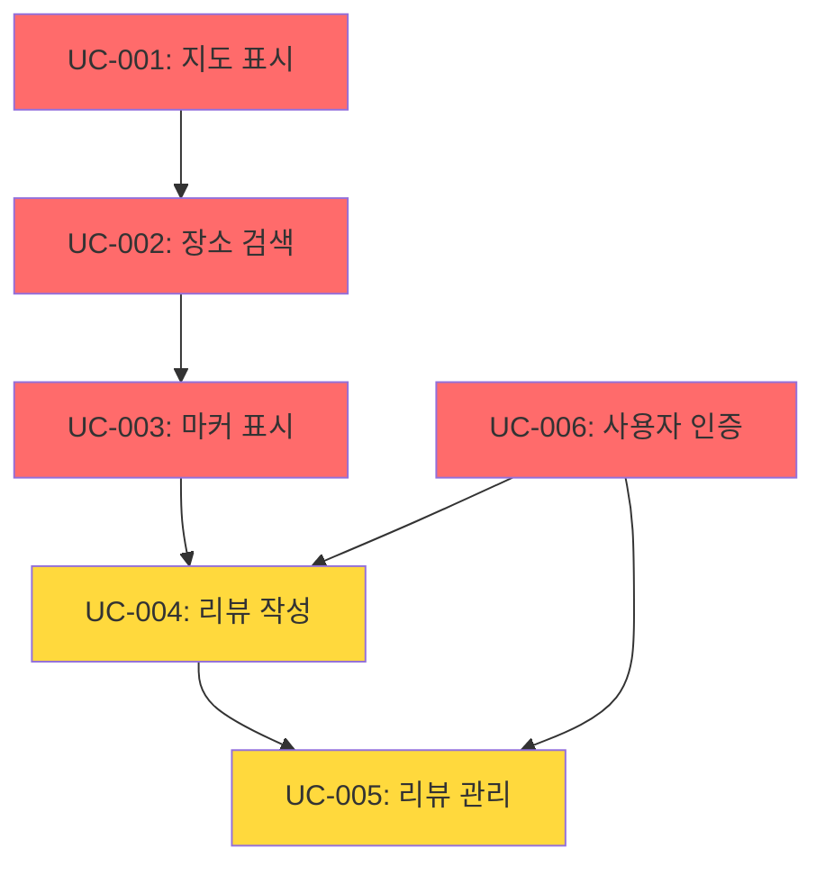

# NaviSpot - Use Case 명세서 목록

## 개요

이 디렉토리는 NaviSpot 프로젝트의 모든 Use Case 명세서를 포함합니다. 각 Use Case는 시스템의 특정 기능을 상세하게 설명하며, 성공 시나리오, 대체 플로우, 예외 처리, 비즈니스 규칙, UI/UX 요구사항, API 명세 등을 포함합니다.

---

## Use Case 목록

### 🔴 Critical Priority

| ID | Use Case명 | 설명 | 상태 | 문서 |
|----|-----------|------|------|------|
| **UC-001** | 지도 표시 | 네이버 지도 SDK를 사용한 지도 로딩 및 상호작용 | ✅ 완료 | [UC-001-map-display.md](./UC-001-map-display.md) |
| **UC-002** | 장소 검색 | 네이버 장소 검색 API를 통한 키워드 기반 검색 | ✅ 완료 | [UC-002-place-search.md](./UC-002-place-search.md) |
| **UC-003** | 마커 표시 | 검색 결과를 지도 마커로 표시 및 클러스터링 | ✅ 완료 | [UC-003-marker-display.md](./UC-003-marker-display.md) |
| **UC-006** | 사용자 인증 | 이메일 기반 로그인/회원가입 (Supabase Auth) | ✅ 완료 | [UC-006-authentication.md](./UC-006-authentication.md) |

### 🟡 High Priority

| ID | Use Case명 | 설명 | 상태 | 문서 |
|----|-----------|------|------|------|
| **UC-004** | 리뷰 작성 | 장소에 대한 별점 및 텍스트 리뷰 작성 | ✅ 완료 | [UC-004-review-creation.md](./UC-004-review-creation.md) |
| **UC-005** | 리뷰 관리 | 본인 리뷰 수정 및 삭제 | ✅ 완료 | [UC-005-review-management.md](./UC-005-review-management.md) |

---

## Use Case 의존성 다이어그램



### 의존성 설명

- **UC-001 (지도 표시)** → **UC-002 (장소 검색)**: 검색 결과를 표시할 지도 필요
- **UC-002 (장소 검색)** → **UC-003 (마커 표시)**: 검색된 장소를 마커로 표시
- **UC-003 (마커 표시)** → **UC-004 (리뷰 작성)**: 마커 클릭 시 리뷰 작성 가능
- **UC-004 (리뷰 작성)** → **UC-005 (리뷰 관리)**: 작성된 리뷰를 수정/삭제
- **UC-006 (사용자 인증)** → **UC-004, UC-005**: 리뷰 작성 및 관리는 인증 필요

---

## Use Case 실행 순서

### 시나리오 1: 비회원 사용자 - 장소 검색 및 조회
```
1. UC-001: 지도 표시 (자동)
2. UC-002: 장소 검색 (사용자 입력)
3. UC-003: 마커 표시 (자동)
4. 리뷰 조회 (읽기 전용)
```

### 시나리오 2: 회원 사용자 - 리뷰 작성
```
1. UC-006: 로그인 (또는 회원가입)
2. UC-001: 지도 표시
3. UC-002: 장소 검색
4. UC-003: 마커 클릭
5. UC-004: 리뷰 작성
6. UC-005: 리뷰 수정/삭제 (선택 사항)
```

---

## Use Case 통계

### 전체 통계
- **총 Use Case 수**: 6개
- **Critical Priority**: 4개 (66.7%)
- **High Priority**: 2개 (33.3%)
- **완료된 Use Case**: 6개 (100%)

### 복잡도 분포
- **Medium**: 6개 (100%)
- **총 추정 개발 시간**: 약 40-60시간

### 액터 분포
- **모든 방문자**: UC-001, UC-002
- **시스템 (자동)**: UC-003
- **인증된 사용자**: UC-004, UC-005
- **비회원 사용자**: UC-006

---

## 빠른 참조

### 핵심 기능 매핑

#### 1. 지도 기능
- **지도 표시**: [UC-001](./UC-001-map-display.md)
- **마커 표시**: [UC-003](./UC-003-marker-display.md)

#### 2. 검색 기능
- **장소 검색**: [UC-002](./UC-002-place-search.md)
- **자동완성**: [UC-002](./UC-002-place-search.md) (A1 플로우)
- **필터링/정렬**: [UC-002](./UC-002-place-search.md) (A3, A4 플로우)

#### 3. 리뷰 기능
- **리뷰 작성**: [UC-004](./UC-004-review-creation.md)
- **리뷰 수정**: [UC-005](./UC-005-review-management.md) (Main Flow - 수정)
- **리뷰 삭제**: [UC-005](./UC-005-review-management.md) (Main Flow - 삭제)

#### 4. 인증 기능
- **로그인**: [UC-006](./UC-006-authentication.md) (Main Flow - 로그인)
- **회원가입**: [UC-006](./UC-006-authentication.md) (Main Flow - 회원가입)
- **로그아웃**: [UC-006](./UC-006-authentication.md) (Store 메서드)

---

## Use Case 문서 구조

각 Use Case 문서는 다음 섹션을 포함합니다:

### 필수 섹션
1. **메타데이터**: ID, 우선순위, 복잡도, 사전/사후조건
2. **주요 성공 시나리오**: 정상적인 실행 흐름
3. **대체 플로우**: 사용자 선택에 따른 다른 경로
4. **예외 플로우**: 오류 상황 처리
5. **비즈니스 규칙**: 기능 동작의 핵심 규칙
6. **성능 요구사항**: 응답 시간 및 처리 속도 목표
7. **테스트 시나리오**: Gherkin 형식의 테스트 케이스

### 추가 섹션 (필요 시)
8. **UI/UX 요구사항**: 컴포넌트 예제 코드
9. **API 명세**: Next.js API Routes 구현
10. **상태 관리**: Zustand Store 정의
11. **보안 요구사항**: RLS 정책, 인증 로직
12. **접근성 요구사항**: ARIA 레이블, 키보드 내비게이션

---

## 읽는 순서 권장사항

### 개발자 (처음 프로젝트 접근)
1. [UC-001: 지도 표시](./UC-001-map-display.md) - 기본 인프라 이해
2. [UC-006: 사용자 인증](./UC-006-authentication.md) - 인증 시스템 이해
3. [UC-002: 장소 검색](./UC-002-place-search.md) - API 연동 이해
4. [UC-003: 마커 표시](./UC-003-marker-display.md) - 지도 상호작용
5. [UC-004: 리뷰 작성](./UC-004-review-creation.md) - 데이터 생성
6. [UC-005: 리뷰 관리](./UC-005-review-management.md) - 데이터 관리

### 기획자/디자이너
1. [UC-002: 장소 검색](./UC-002-place-search.md) - 핵심 사용자 플로우
2. [UC-004: 리뷰 작성](./UC-004-review-creation.md) - 주요 사용자 인터랙션
3. [UC-001: 지도 표시](./UC-001-map-display.md) - UI 레이아웃 기본
4. [UC-006: 사용자 인증](./UC-006-authentication.md) - 온보딩 플로우

### QA 엔지니어
1. 모든 Use Case의 **테스트 시나리오** 섹션 우선 검토
2. **예외 플로우** 섹션으로 엣지 케이스 파악
3. **성능 요구사항** 섹션으로 성능 테스트 기준 확인

---

## 비즈니스 규칙 요약

### 지도 및 검색
- 초기 위치: 서울 시청 (37.5666103, 126.9783882)
- 검색 응답 시간: < 2초
- 자동완성 debounce: 300ms
- 페이지당 검색 결과: 10개

### 리뷰
- 리뷰 길이: 최소 10자, 최대 500자
- 별점: 1-5 (필수)
- 1인 1리뷰 (장소당)
- 수정 가능 시간: 작성 후 5분 이내
- 삭제 가능 시간: 제한 없음

### 인증
- 이메일 형식: RFC 5322 표준
- 비밀번호: 최소 8자, 영문/숫자 혼합 권장
- 닉네임: 2-20자, 중복 불가
- 세션 유효 기간: 7일 (Refresh Token 30일)

---

## API 엔드포인트 요약

### 검색
- `GET /api/search?query={keyword}&display={10}&start={1}` - 장소 검색

### 리뷰
- `POST /api/reviews` - 리뷰 작성
- `PATCH /api/reviews/[id]` - 리뷰 수정
- `DELETE /api/reviews/[id]` - 리뷰 삭제
- `GET /api/reviews?place_id={id}` - 장소별 리뷰 조회

### 인증
- Supabase Auth 기본 엔드포인트 사용
- `signInWithPassword()` - 로그인
- `signUp()` - 회원가입
- `signOut()` - 로그아웃

---

## 데이터베이스 테이블 매핑

### users (UC-006)
- 사용자 프로필 정보
- RLS: 본인 정보만 수정 가능

### reviews (UC-004, UC-005)
- 리뷰 데이터
- RLS: 본인 리뷰만 수정/삭제 가능

### places (선택 사항)
- 검색 결과 캐싱용
- 네이버 API 응답을 그대로 사용하는 경우 불필요

---

## 성능 목표 요약

| Use Case | 핵심 지표 | 목표 |
|---------|---------|------|
| UC-001 | 지도 로딩 | < 3초 |
| UC-002 | 검색 응답 | < 2초 |
| UC-003 | 마커 생성 | < 500ms (50개) |
| UC-004 | 리뷰 제출 | < 1초 |
| UC-005 | 리뷰 수정/삭제 | < 1초 / < 500ms |
| UC-006 | 로그인/회원가입 | < 2초 |

---

## 관련 문서

- **프로젝트 요구사항**: [../requirement.md](../requirement.md)
- **사용자 플로우**: [../userflow.md](../userflow.md)
- **기술 스택**: [../tech-stack.md](../tech-stack.md)
- **코드베이스 구조**: [../codebase-structure.md](../codebase-structure.md)
- **데이터베이스 스키마**: [../database.md](../database.md)
- **외부 API 연동**: [../external/naver-maps-search.md](../external/naver-maps-search.md)

---

## 변경 이력

| 버전 | 날짜 | 작성자 | 변경 내용 |
|------|------|--------|----------|
| 1.0 | 2025-10-23 | SuperNext Agent 05 | 초기 작성 (UC-001 ~ UC-006) |

---

**작성일**: 2025-10-23
**버전**: 1.0
**작성자**: SuperNext Agent 05 (Use Case Generator)
