# NaviSpot - User Flow

## 전체 플로우 개요

NaviSpot은 지도 탐색, 장소 검색, 리뷰 작성 3가지 주요 플로우로 구성됩니다.

---

## 1. 메인 화면 진입 플로우


**주요 상태**:
- 초기 로딩: 지도 SDK 로드 (< 3초)
- 인증 확인: Supabase Auth 세션 체크
- 지도 초기화: 서울 시청 (37.5666103, 126.9783882)

---

## 2. 장소 검색 플로우


**API 연동**:
- 엔드포인트: `GET /v1/search/local.json`
- 헤더: `X-Naver-Client-Id`, `X-Naver-Client-Secret`
- 파라미터:
  - `query`: 검색어
  - `display`: 10 (페이지당 개수)
  - `start`: 1 (시작 위치)
  - `sort`: random (정렬 방식)

**응답 예시**:
```json
{
  "items": [
    {
      "title": "스타벅스 강남역점",
      "address": "서울특별시 강남구 역삼동 123-45",
      "category": "음식점>카페,디저트",
      "mapx": "1270000",
      "mapy": "375000"
    }
  ]
}
```

---

## 3. 장소 상세 조회 플로우

```mermaid
flowchart TD
    MarkerClick([마커 또는<br/>리스트 항목 클릭]) --> ShowPopup[장소 상세 팝업 표시]
    ShowPopup --> LoadPlaceInfo[장소 기본 정보 표시<br/>이름, 주소, 카테고리]

    LoadPlaceInfo --> LoadReviews[Supabase에서<br/>리뷰 조회]
    LoadReviews --> CalcRating[평균 평점 계산<br/>총 리뷰 수 집계]

    CalcRating --> ShowStats[리뷰 통계 표시<br/>⭐ 4.5 (리뷰 12개)]
    ShowStats --> ShowRecentReviews[최신 리뷰 3개 표시]

    ShowRecentReviews --> UserAction{사용자<br/>액션}

    UserAction -->|리뷰 전체 보기| ShowAllReviews[리뷰 전체 목록 모달]
    UserAction -->|리뷰 작성| CheckAuth{로그인<br/>여부}
    UserAction -->|닫기| ClosePopup([팝업 닫기])

    CheckAuth -->|로그인| WriteReviewForm[리뷰 작성 폼]
    CheckAuth -->|미로그인| LoginPrompt[로그인 유도 다이얼로그]

    LoginPrompt --> UserDecision{사용자<br/>선택}
    UserDecision -->|로그인| LoginFlow[로그인 플로우]
    UserDecision -->|취소| ClosePopup

    style MarkerClick fill:#e1f5ff
    style LoadReviews fill:#ffe1e1
    style ClosePopup fill:#fff4e1
```

**데이터 흐름**:
1. 클라이언트 → Supabase: `SELECT * FROM reviews WHERE place_id = ?`
2. Supabase → 클라이언트: 리뷰 배열 반환
3. 클라이언트: 평균 평점 계산, 최신 3개 필터링

---

## 4. 리뷰 작성 플로우


**데이터 구조**:
```typescript
interface ReviewInput {
  place_id: string         // 네이버 장소 ID
  place_name: string       // 장소명 (검색 결과에서)
  user_id: UUID            // Supabase Auth UID
  rating: number           // 1-5
  content: string          // 최대 500자
}
```

**Supabase 삽입 쿼리**:
```sql
INSERT INTO reviews (place_id, place_name, user_id, rating, content)
VALUES ($1, $2, $3, $4, $5)
RETURNING *;
```

---

## 5. 리뷰 수정/삭제 플로우


**RLS (Row Level Security) 정책**:
```sql
-- 수정: 본인 리뷰만 가능
CREATE POLICY update_own_review ON reviews
FOR UPDATE USING (auth.uid() = user_id);

-- 삭제: 본인 리뷰만 가능
CREATE POLICY delete_own_review ON reviews
FOR DELETE USING (auth.uid() = user_id);
```

---

## 6. 인증 플로우


**회원가입 플로우** (간소화):


---

## 7. 지도 인터랙션 플로우


---

## 에러 처리 플로우

```mermaid
flowchart TD
    Error([에러 발생]) --> CheckType{에러<br/>타입}

    CheckType -->|네트워크 에러| ShowNetworkError[네트워크 오류<br/>인터넷 연결 확인]
    CheckType -->|API 제한 초과| ShowRateLimit[API 제한 초과<br/>잠시 후 다시 시도]
    CheckType -->|인증 에러| ShowAuthError[로그인 필요<br/>로그인 유도]
    CheckType -->|DB 에러| ShowDBError[일시적 오류<br/>재시도 유도]
    CheckType -->|지도 로드 실패| ShowMapError[지도 로드 실패<br/>새로고침 권장]

    ShowNetworkError --> Retry{재시도?}
    ShowRateLimit --> Wait[1분 대기]
    ShowAuthError --> LoginFlow[로그인 플로우]
    ShowDBError --> Retry
    ShowMapError --> Reload[페이지 새로고침]

    Retry -->|예| RetryAction[원래 작업 재시도]
    Retry -->|아니오| Cancel([취소])

    Wait --> RetryAction

    RetryAction --> Success{성공?}
    Success -->|예| End([완료])
    Success -->|아니오| Error

    LoginFlow --> End
    Reload --> End
    Cancel --> End

    style Error fill:#ffe1e1
    style End fill:#fff4e1
```



---

## 주요 상태 관리 (Zustand)

```typescript
interface AppState {
  // 지도 상태
  map: naver.maps.Map | null
  markers: naver.maps.Marker[]
  selectedPlace: Place | null

  // 검색 상태
  searchQuery: string
  searchResults: Place[]
  isSearching: boolean

  // 리뷰 상태
  reviews: Review[]
  isLoadingReviews: boolean

  // 인증 상태
  user: User | null
  session: Session | null

  // UI 상태
  isPopupOpen: boolean
  isReviewFormOpen: boolean
}
```

---

## 성능 최적화 플로우


---

**작성일**: 2025-10-23
**버전**: 1.0
**작성자**: SuperNext Agent 02
